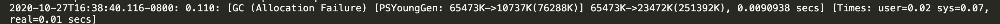
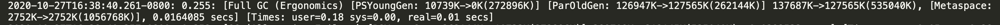

# GC 日志详解

> 命令：`java -Xloggc:gc.demo.log -XX:+PrintGCDetails -XX:+PrintGCDateStamps GCLogAnalysis`

### 年轻代GC
 

参数说明：
- 2020-10-27T16:38:40.116-0800: 0.110
    - 时间戳       
- [GC (Allocation Failure)]
    - 年轻代GC（内存分配失败）：
- [PSYoungGen: 65473K->10737K(76288K)] 
    - 65473K    
        - **年轻代垃圾回收前内存**占用大小
        
    - 10737K   
        **年轻代垃圾回收后内存**占用大小
    - (76288K)  
        年轻代总大小
    > Young 区回收比例较高
- 65473K->23472K(251392K)
    - 65473K  
        - **堆内存垃圾回收前内存**占用大小
    - 23472K    
        - **堆内存垃圾回收后内存**占用大小
    - 251392K   
        - **堆内存**总大小
    > 此时 Young 区减少的量 > 堆内存减少的量，因为部分 Young 区对象提升到 Old 区
- 0.0090938 secs
    - YoungGC耗时
- [Times: user=0.02 sys=0.07, real=0.01 secs]
    - user=0.02 用户线程耗时
    - sys=0.07  系统线程耗时
    - real=0.01 真实耗时
    - secs      时间单位秒

### 老年代GC
 
 
参数说明：
- 2020-10-27T16:38:40.261-0800: 0.255
    - 时间戳       
- Full GC (Ergonomics)
    - YoungGC + OldGC
- [PSYoungGen: 10739K->0K(272896K)] 
    - 同上
- [ParOldGen: 126947K->127565K(262144K)] 
    - 126947K    
    **老年代垃圾回收前内存**占用大小
    - 127565K    
    **老年代垃圾回收后内存**占用大小
    - (262144K)  
    老年代总大小
    > Old 区减少的比例比较小，甚至反升
- 137687K->127565K(535040K)
    - 137687K    
    **堆内存垃圾回收前内存**占用大小
    - 127565K    
    **堆内存垃圾回收后内存**占用大小
    - 535040K    
    **堆内存**总大小
- [Metaspace: 2752K->2752K(1056768K)]
    - Metaspace 
    元空间
    - 2752K     
    元空间垃圾回收前占用大小
    - 2752K     
    元空间垃圾回收后占用大小
    - 1056768K  
    元空间总大小
- 0.0164085 secs
    - FullGC耗时
- [Times: user=0.18 sys=0.00, real=0.01 secs]
    - 同上
    
如果 FullGC 之后，堆内存还是不够用，只能 OOM

--- 
# 堆内存对系统应用的影响

如果堆内存比较小，应用程序内使用的内存量较大，会导致 YoungGC频繁，甚至 FullGC频繁，或者 OOM
- 堆内存越小，FullGC 收缩的比例就会越低，导致 FullGC次数增加，但 free 出来的空间并没有增加，甚至，没有变化
    - 这是由于没有可用的空间供移动大对象导致
