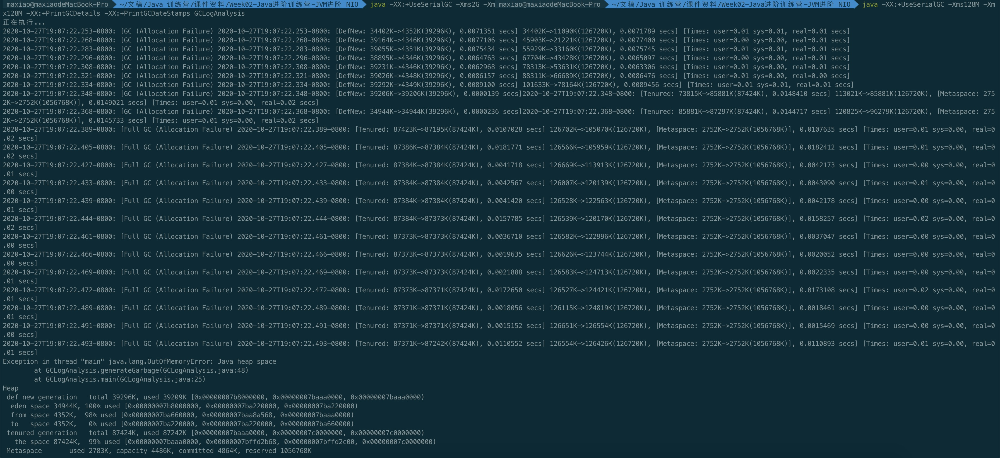
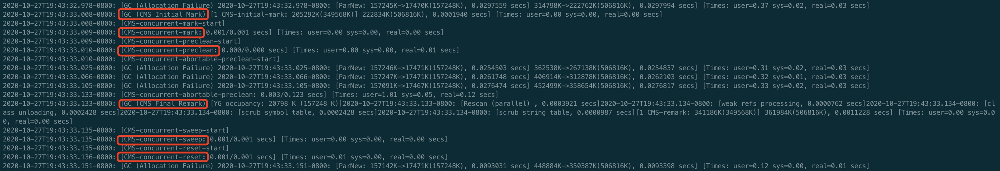
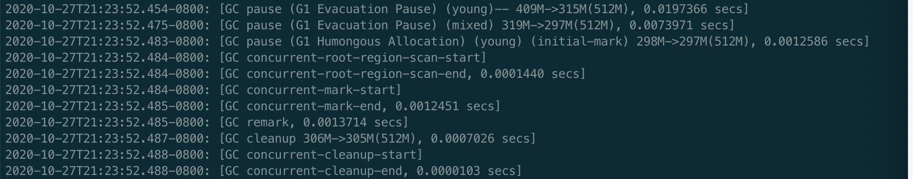

# 串行GC
SerialGC:
    java -XX:+UseSerialGC -Xms512m -Xmx512m -XX:+PrintGCDetails -XX:+PrintGCDateStamps 
    
    出现了三个GC发生的区域：
        DefNew:     Default New Generation = eden + from survivor
        Tenured:    年老代空间信息
        Metaspace   元数据区
    
随着堆内存的增大，单次GC时间会随之拉长，同时不容易发生 FullGC

随着堆内存的减少，FullGC 收缩的比例就会越低，导致 FullGC次数增加，但 free 出来的空间并没有增加，甚至，没有变化（这是由于没有可用的空间供移动大对象导致）
        FullGC一直在进行中，基本上相当于应用宕机
        
YoungGC：只清理 Young 区，Eden + S0 -> S1（部分或晋升到Old），清空 S0，Old 区不清理
FullGC：Young 区占用比例清理至 0，清理部分 Old 区对象

# 并行GC
ParallelGC：
   > java -XX:+UseParallelGC -Xms512m -Xmx512m -XX:+PrintGCDetails -XX:+PrintGCDateStamps 
    
单次 GC 时间明显短于串行 GC

并行 GC 在更低堆内存的情况下，GC 情况要比串行 GC 更优秀一点
    
YoungGC：只清理 Young 区，Eden + S0 -> S1（部分或晋升到Old），清空 S0，Old 区不清理
FullGC：Young 区占用比例清理至 0，清理部分 Old 区对象

# CMS



# G1



---
# -Xms 对 GC 的影响
不配置 -Xms 的话，第一次 YoungGC 会提前（Young 区相对更小的时候就会触发

--- 

# 在不同GC下，压测的吞吐量横向比较 & 纵向比较
测试环境为 MacOS 10.15 | Jdk8 | 16核

测试脚本见： [GCAnalysis](../scripts/GCAnalysis.py)

测试样本取10次平均值

测试命令如 ： `java -Xmx8g -Xms8g -XX:+UseG1GC -Xloggc:log/gc_8g_UseG1GC_9.log GCLogAnalysis`

<table>
    <tr>
        <td>GC / Heap（时间单位s）</td>
        <td>128M</td>
        <td>512M</td>
        <td>1G</td>
        <td>2G</td>
        <td>4G</td>
        <td>8G</td>
    </tr>
    <tr>
        <td>Serial</td>
        <td>OOM</td>
        <td>0.61949208</td>
        <td>0.4716358</td>
        <td>0.441421833</td>
        <td>0.266333133</td>
        <td>0.159115533
</td>
    </tr>
    <tr>
        <td>Parallel</td>
        <td>OOM</td>
        <td>0.6325983</td>
        <td>0.5024475</td>
        <td>0.4136208</td>
        <td>0.3052983</td>
        <td>0.1485401</td>
    </tr>
    <tr>
        <td>CMS</td>
        <td>OOM</td>
        <td>0.6064802</td>
        <td>0.4893572</td>
        <td>0.4590256</td>
        <td>0.3667725</td>
        <td>0.3671848</td>
    </tr>
    <tr>
        <td>G1</td>
        <td>OOM</td>
        <td>0.4693535</td>
        <td>0.2885263</td>
        <td>0.3440758</td>
        <td>0.4387819</td>
        <td>0.4878826</td>
    </tr>    
</table>

```
在 128M 堆内存下，四种 GC 均 OOM 或者出现持续 FullGC
SerialGC的GC时间持续走低，相比G1持续升高的现象。是否存在何处测试错误？请老师指正
```